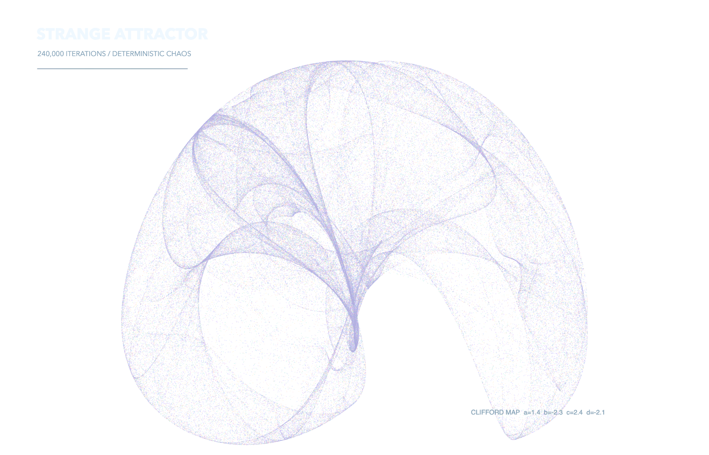
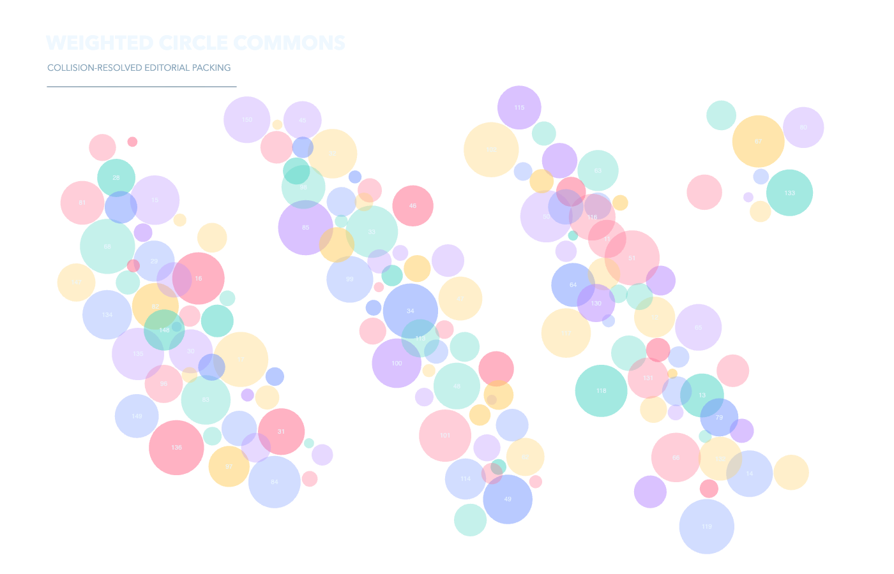
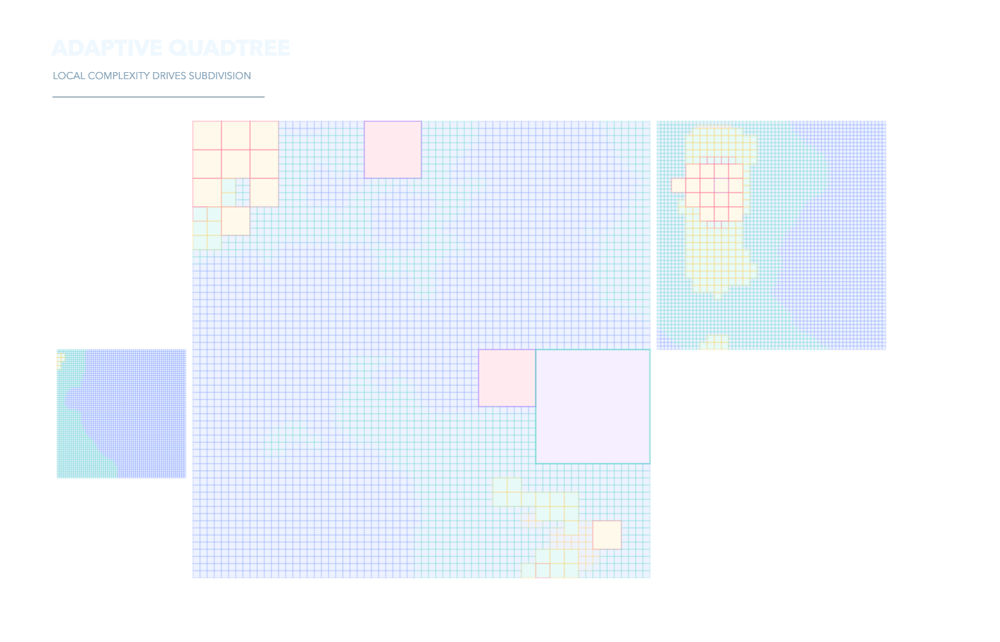
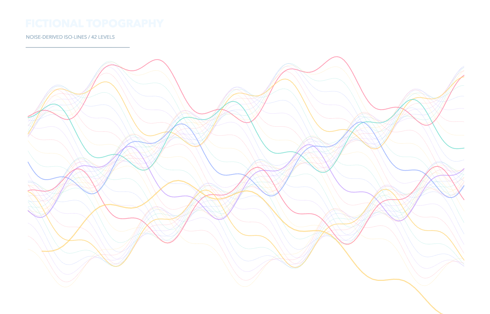
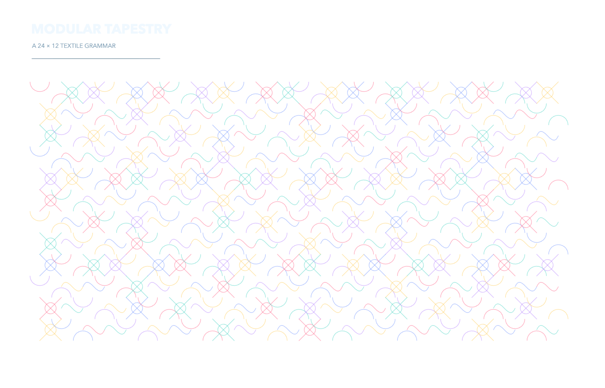
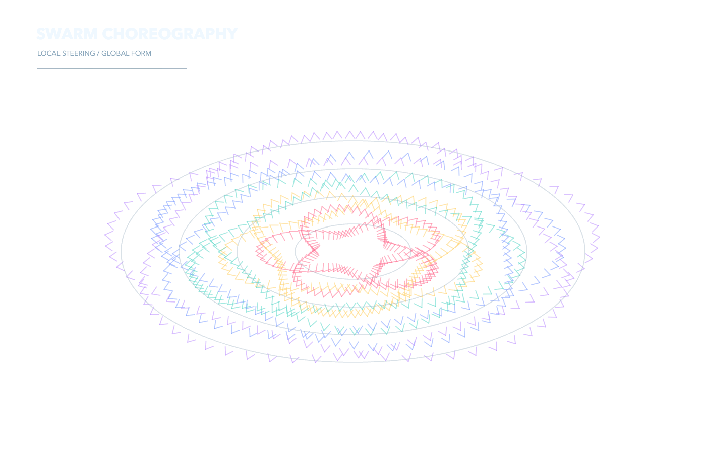
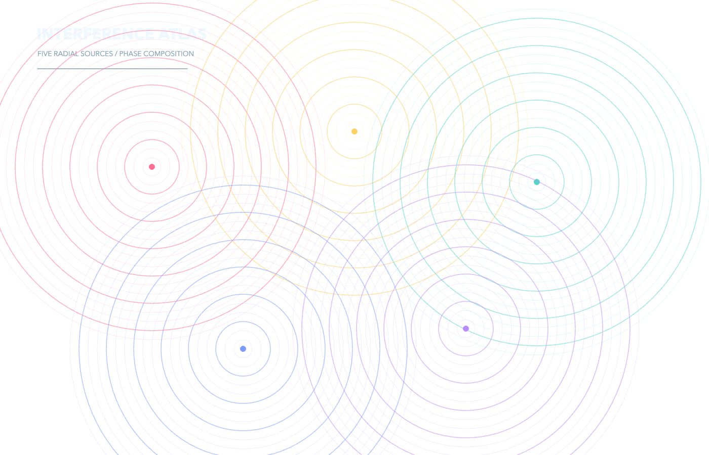
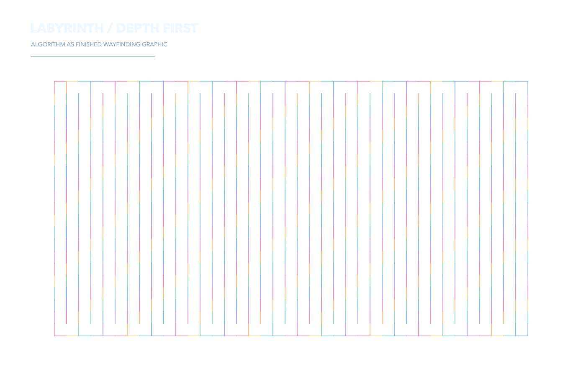
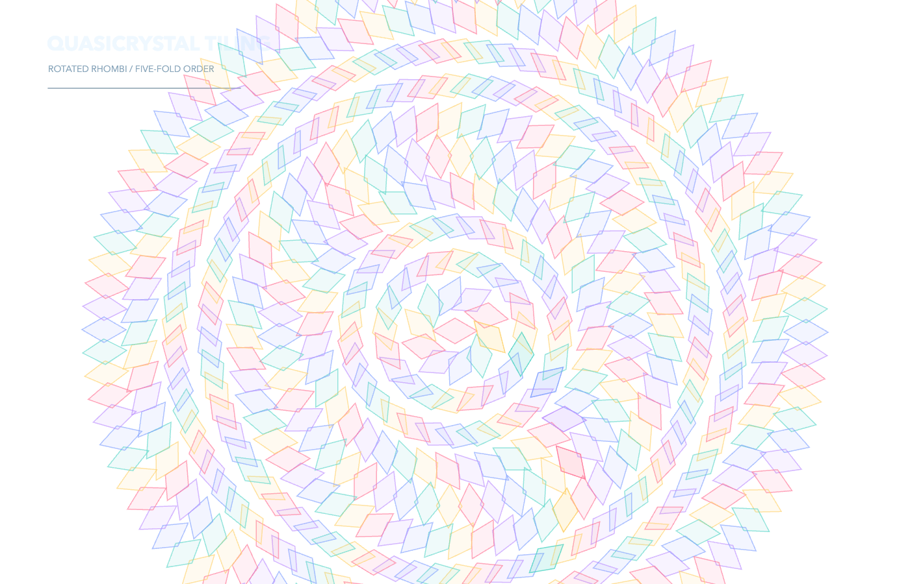

# Generative Art Demos

Twelve deterministic p5.js sketches designed as finished transparent PNG compositions rather than perpetual animations.

`catalog.json` makes each visual searchable by use case, question, family, complexity, and technique tags.

| Flow field | Reaction | Botanical | Attractor |
|---|---|---|---|
|  |  |  |  |
| Circle packing | Quadtree | Topography | Tapestry |
|  |  |  |  |
| Swarm | Interference | Maze | Tiling |
|  |  |  |  |

Run `npm install && npm test`. The test launches real Chrome offline, captures alpha-preserving PNGs, validates pixels, and checks pointer interaction.
