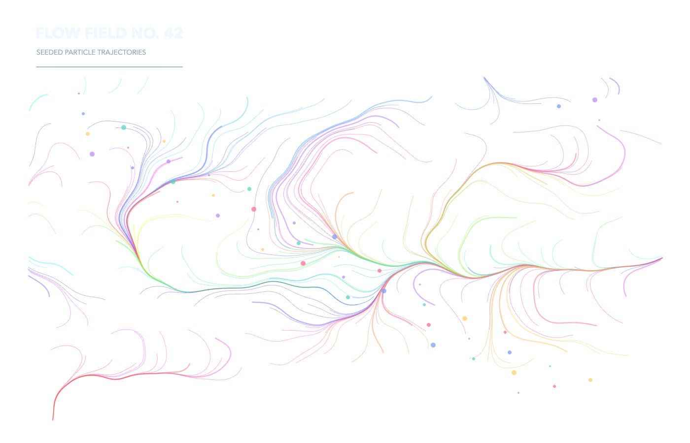
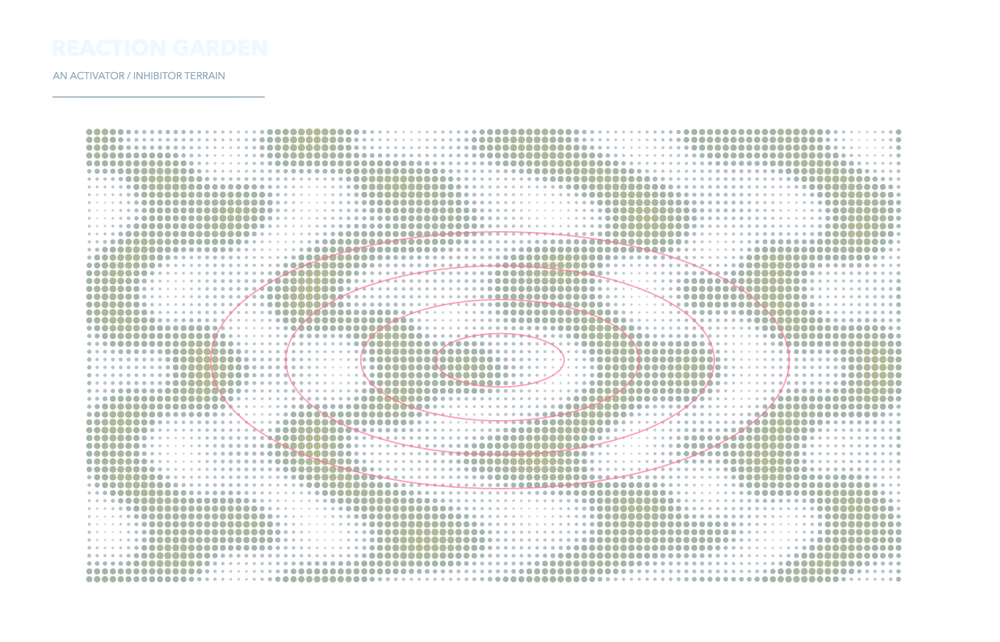
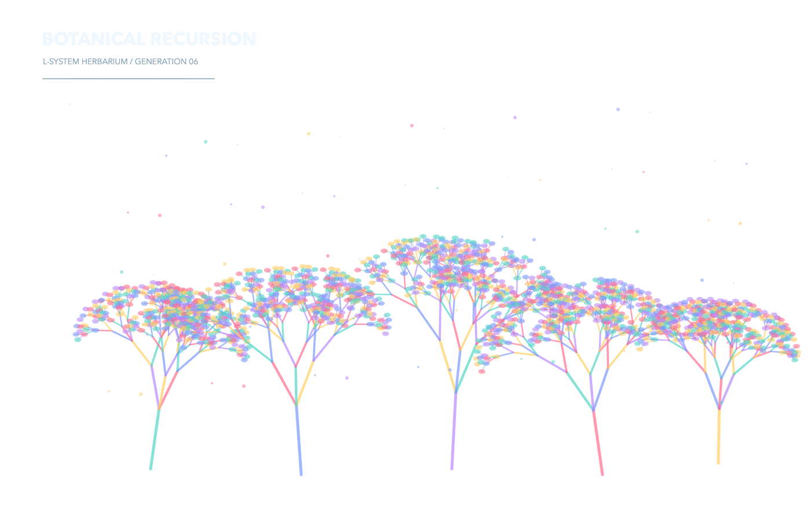

# Generative Art Demos

Deterministic p5.js sketches designed as finished transparent PNG compositions rather than perpetual animations.

| Scene | Preview | Technique |
|---|---|---|
| Flow field |  | Curl-like noise trajectories |
| Reaction garden |  | Iterated activator/inhibitor field |
| Botanical recursion |  | L-system branching and seeded blossoms |

Run `npm install && npm test`. The test launches real Chrome offline, captures alpha-preserving PNGs, validates pixels, and checks pointer interaction.
